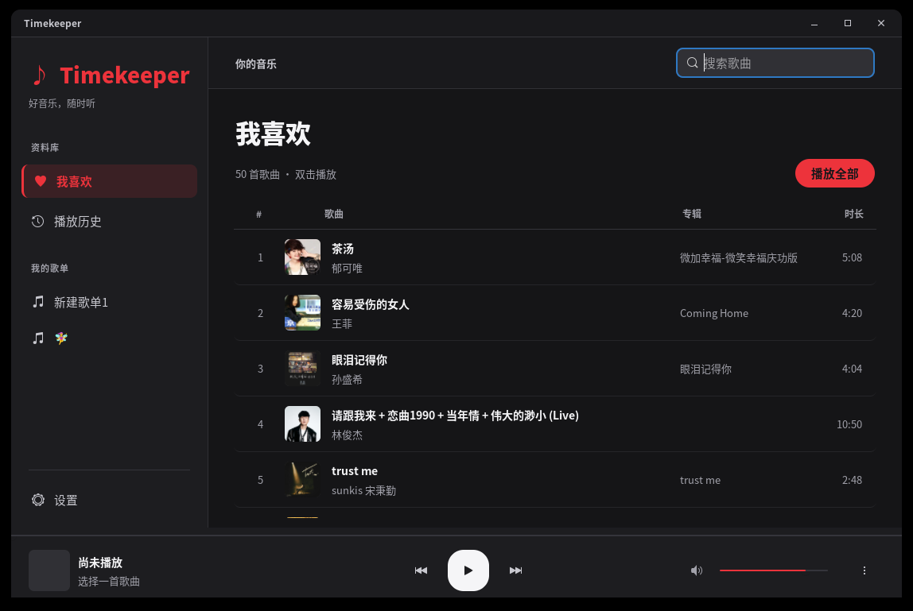
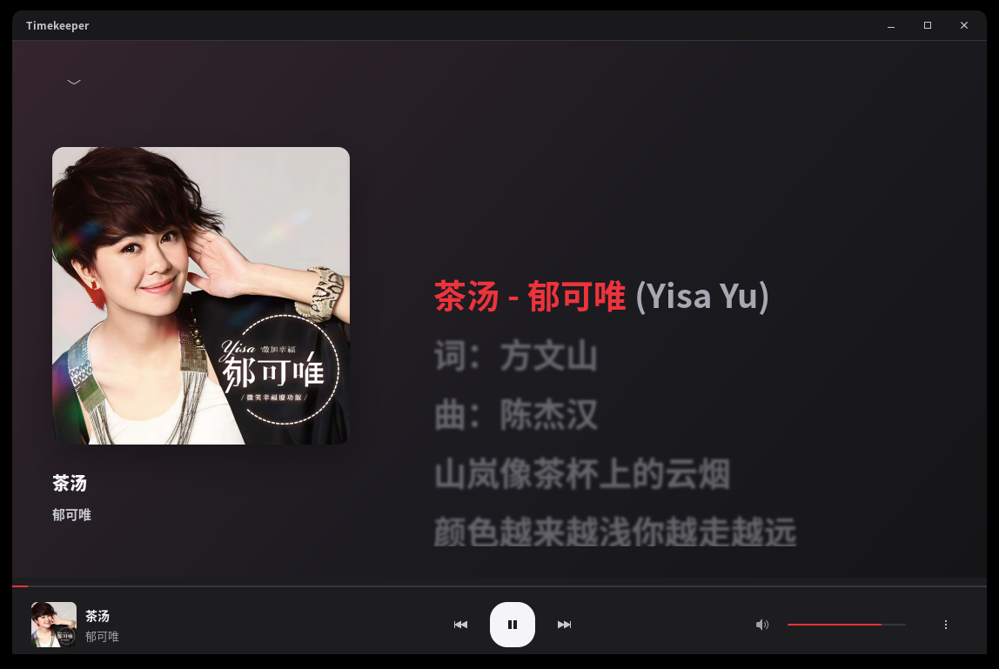

# Timekeeper

Timekeeper 是一款面向 Linux 的非官方 QQ 音乐桌面播放器，使用 GTK 4 构建。登录自己的 QQ 音乐账号后，可以浏览「我喜欢」与自建歌单、搜索歌曲并在线播放。界面以资料库、紧凑播放栏和独立歌词页为核心，支持深浅色模式。

> **0.1.0 Beta**：目前主要在 Ubuntu 24.04 amd64 的原生 Wayland 会话中测试。项目仍在完善，QQ 音乐接口变化、会员权限及地区版权限制都可能影响登录或播放。

## 界面预览

### 资料库



### 播放与同步歌词



## 已实现功能

- **账号与资料库**：QQ 扫码登录；读取「我喜欢」和自建歌单；在设置中切换账号或注销。歌曲列表接近底部时自动加载下一页。
- **搜索与播放**：搜索歌曲、播放整个列表、上一首／下一首、随机播放、单曲循环、拖动进度、调节音量；播放失败后可点击播放键重试。
- **音质**：默认「自动」，优先尝试高品质，接口不提供或持续缓冲时切换为标准音质；也可在设置中固定标准、高品质或无损。实际可播放音质由 QQ 音乐账号和歌曲决定。
- **歌词页**：点击底栏封面打开或关闭播放页。优先显示 QRC 逐字高光，缺少逐字数据时使用 LRC 逐行歌词；支持触摸板滚动和点击歌词跳转。歌词缺失时会显示提示。
- **播放历史**：按账号在本机保存最近播放的最多 500 首不同歌曲，重复播放的歌曲移到最前。
- **外观与桌面集成**：深色／浅色模式、主题色、歌词字号和高光颜色；支持 MPRIS 媒体控制，以及桌面环境提供状态栏托盘时的托盘操作。

界面设计参考 [Apple Music](https://music.apple.com/)、[Lyrune](https://github.com/amtoaer/lyrune) 和 [YAQMC](https://github.com/YAQMC/YAQMC) 的部分布局与交互；本项目独立实现，未获得 QQ 音乐官方授权。

## 安装测试版

从 [v0.1.0-beta.1 发布页](https://github.com/Timekeeperxxx/Timekeeper/releases/tag/v0.1.0-beta.1) 下载适合系统的文件：

| 格式 | 适用系统 | 安装或运行 |
| --- | --- | --- |
| `.deb` | Ubuntu 24.04 amd64 | `sudo apt install './timekeeper_0.1.0~beta1_amd64.deb'` |
| `.rpm` | Fedora 44 x86_64 | `sudo dnf install ./timekeeper-0.1.0-0.beta1.fc44.x86_64.rpm` |
| `.AppImage` | Ubuntu 24.04 amd64 及兼容环境 | `chmod +x Timekeeper-0.1.0-beta.1-x86_64.AppImage && ./Timekeeper-0.1.0-beta.1-x86_64.AppImage` |

例如，Ubuntu 用户下载 `.deb` 后执行：

```bash
sudo apt install './timekeeper_0.1.0~beta1_amd64.deb'
```

安装 `.deb` 或 `.rpm` 后，从应用菜单打开 **Timekeeper**，或在终端运行 `timekeeper`。包管理器会安装缺少的系统依赖。AppImage 无需安装，但这个 Beta 包仅内置应用及 Python 第三方依赖，仍需宿主机提供 **Python 3.12、PyGObject、GTK 4 和 GStreamer**；在 Ubuntu 24.04 上可先安装下方「从源码运行」列出的系统依赖。它不是跨发行版完全自包含的 AppImage。

卸载 `.deb` 可运行 `sudo apt remove timekeeper`；卸载 `.rpm` 可运行 `sudo dnf remove timekeeper`。账号配置和播放历史不会随卸载自动删除。

其他发行版、CPU 架构及强制 X11 会话尚未完成发布验收。尤其是 X11 下的触摸板歌词滚动，可靠性仍待验证。

## 从源码运行

在 Ubuntu 24.04 上安装运行依赖：

```bash
sudo apt install python3.12-venv python3-gi gir1.2-gtk-4.0 \
  gir1.2-gstreamer-1.0 gstreamer1.0-plugins-base gstreamer1.0-plugins-good
python3 -m venv --system-site-packages .venv
.venv/bin/pip install -r requirements.txt
.venv/bin/python app.py
```

虚拟环境使用 `--system-site-packages`，以便访问系统安装的 PyGObject。在线音频解码能力取决于本机 GStreamer 插件。

## 使用方法

1. 打开设置页，点击「扫码登录」，使用手机 QQ 扫码并确认。二维码过期时可点击「重新获取二维码」。
2. 在左侧选择「我喜欢」「播放历史」或歌单；双击歌曲进入播放页，或点击「播放全部」。
3. 点击底栏左侧封面切换播放页。滚动歌词可查看前后内容，点击某句从该处开始播放。
4. 在设置页调整播放音质、界面外观和歌词样式；切换账号或注销登录也位于设置页。

| 快捷键 | 操作 |
| --- | --- |
| `空格` | 播放／暂停 |
| `PageUp` / `PageDown` | 上一首／下一首 |
| `Ctrl+K` | 聚焦搜索框 |

在输入框中打字时，不会触发播放快捷键。

## 本机数据与限制

登录凭证保存在 `$XDG_CONFIG_HOME/player/credential.json`，默认路径为 `~/.config/player/credential.json`。这是为兼容早期版本沿用的目录；请勿分享其中的文件。播放历史按账号保存在同一目录，注销登录只删除凭证，不清除历史。应用不要求或读取 QQ 密码，不提供歌曲下载，也不长期缓存音频文件；播放地址临时获取。

Timekeeper 使用非官方 [QQMusicApi](https://github.com/L-1124/QQMusicApi) 接口。接口变更、会员资格、歌曲下架或地区版权限制均可能导致个别功能不可用。请遵守 [腾讯音乐服务协议](https://www.tencentmusic.com/zh-cn/protocol.html)。本项目与腾讯音乐没有隶属或授权关系。

## 开发与反馈

在 Ubuntu 24.04 amd64 上安装 `dpkg-dev` 后运行 `./build-deb.sh`，输出为 `dist/timekeeper_0.1.0~beta1_amd64.deb`。随后用 [appimagetool](https://github.com/AppImage/appimagetool/releases) 运行 `./build-appimage.sh` 可生成 AppImage。RPM 在 Fedora 44 x86_64 上安装 `rpm-build`、`python3-pip` 后运行 `./build-rpm.sh`。三个脚本都只打包应用和 Python 第三方依赖，GTK 与 GStreamer 由系统提供。运行现有自动测试：

```bash
.venv/bin/python -m unittest discover -v
```

如需排查歌词触摸板滚动，可用 `TIMEKEEPER_SCROLL_LOG=/tmp/timekeeper-scroll.log timekeeper` 启动；日志只记录滚动事件、位置和窗口尺寸，正常启动不会写入此日志。

问题与建议请提交到 [GitHub Issues](https://github.com/Timekeeperxxx/Timekeeper/issues)。版本变更和已知边界见 [发布说明](RELEASE_NOTES.md)。项目以 [GPL-3.0-or-later](LICENSE) 发布，第三方依赖保留各自的许可证。
